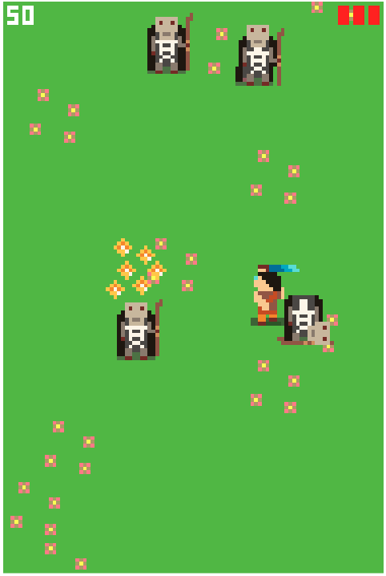

# Runner13k

[Demo](https://daxrt.github.io/runner13k/dist/index.html)


## License

Runner13k is released under [GNU GPL v3](LICENSE).

Copyright (C) 2018 Akhtarov Danil

This program is free software: you can redistribute it and/or modify
it under the terms of the GNU General Public License as published by
the Free Software Foundation, either version 3 of the License, or
(at your option) any later version.

This program is distributed in the hope that it will be useful,
but WITHOUT ANY WARRANTY; without even the implied warranty of
MERCHANTABILITY or FITNESS FOR A PARTICULAR PURPOSE.  See the
GNU General Public License for more details.

You should have received a copy of the GNU General Public License
along with this program.  If not, see <https://www.gnu.org/licenses/>.

### Kontra.js

`kontra.js` is released under
[MIT License](https://github.com/straker/kontra/blob/master/LICENSE).

Copyright (c) 2015 Steven Lambert.

### TinyMusic

`TinyMusic` is released under

[MIT License](https://github.com/kevincennis/TinyMusic/blob/master/LICENSE).

## Get started

```bash
npm run start
```

```bash
npm run build
```


